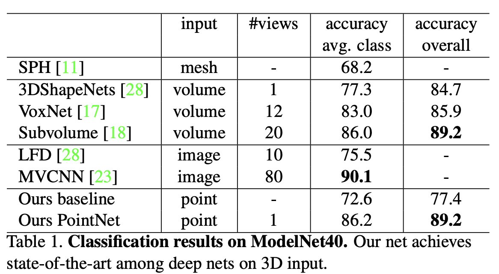

# \[CVPR 2017\] PointNet: Deep Learning on Point Sets for 3D Classification and Segmentation

## Introduction

3D data 의 종류로 위의 3가지가 가장 주로 이용이 된다고 합니다. 각 점들이 그래프 형태로 연결된 Mesh, volume + pixel 이라는 뜻으로 pixel 처럼 일정한 간격의 값이 3D 공간 상에 위치한 voxel, 그리고 각 점들의 집합인 point cloud 가 있다고 합니다. point cloud 는 중요한 geometric data structure 중 하나이지만 이는 irregular format 이라는 단점이 있었습니다. 이 irregular format 이라 하면 이미지의 pixel 처럼 일정한 간격으로 값을 갖고 있거나 그 값들의 순서가 명확하지 않고 그저 여러 points 의 set 이라는 의미입니다. 그렇기 때문에 이전 연구들에서는 이를 regular 3D voxel grids or collections of images 로 변형하여 이용하곤 했었습니다. 하지만 이렇게 만들어진 데이터는 불필요하게 방대해지고 그로 인해서 여러 문제들이 발생할 수 있습니다. 그렇기 때문에 이 논문에서는 point cloud data 를 가공하지 않고 직접적으로 이용할 수 있는 PointNet 을 제안하게 되었습니다. 이는 object classification, part segmentation, scene semantic parsing 등 여러 분야에 적용될 수 있으며 성능에도 효과적이고 robust 한 특성도 갖고 있다고 합니다.

## Properties of Point Sets in $R^n$

- **Unordered**. image 의 pixel 이나 volumetric grids 의 voxel 과 다르게 point clouds 는 특정한 순서가 없는 set of points 입니다. 그렇기 때문에 N 개의 3D point sets 을 사용하는 network 는 N! permutation 에 invariant 해야합니다. 즉, N 개의 point sets 이 있다면 이것은 N! 개의 순서가 발생할 수 있는데 어떠한 순서로 입력이 되더라도 그와 무관하게 같은 output 이 발생해야합니다.

- **Interaction among points**. 각 points 는 주변 points 와 함께 어떠한 의미, 지역적 특징을 갖을 수 있어야 합니다.
- **Invariance under transformations**. 모든 점들에게 rotating, traslating 등을 적용하였을 때 해당 point cloud 가 나타내고 있던 전반적인 object category 나 segmentation 등이 변형되면 안 됩니다.

## PointNet Architecture

PointNet 의 전체적인 구조는 위 Fig 2 에 나타나있습니다. 이 network 에는 3가지 핵심 모듈이 있습니다.

### Symmetry Function for Undordered Input

해당 논문에서는 input permutation 에 invariant 한 network 를 만들기 위해서 가장 마지막에 elements 에 symmetric function 인 max pooling 을 적용합니다. symmetric function 이란 f(x, y, z) = f(y, z, x) = …. 인 변수 교환에 대해 불변인 다변수 함수를 뜻합니다. 저 각 변수들이 points 라 생각했을 때 symmetric function 을 이용하게되면 points 들의 permutation 에 invariant 하도록 만들 수 있게 되는 것 입니다.

위 그림처럼 각 point 마다 mlp 를 통해서 feature 를 생성하고 그 후 max pooling 를 통해 1024 개의 feature를 생성하게 되는데 이때 생성되는 feature 를 global feature 라고 합니다.

### Local and Global Information Aggregation

위에서 생성된 outputs 인 global feature 을 통해서 SVM or multi-layer perceptron classifier 를 통해서 classification 을 진행할 수 있습니다. 하지만 point segmentation 은 local and global feature 가 필요합니다. 위 Fig. 2 의 segmentation network 의 구조를 보면 global feature 를 구하기 전 point feature 를 local feature 로 보고 이 local feature 와 global feature 를 concatenating 하여 segmentation network 에 주어지게 됩니다.

### Joint Alignment Network

point cloud 의 semantic labeling 은 이 point cloud 에 어떤 특정한 geometric transformation 이 되더라도 변함이 없어야 합니다. 그러기 위해서 이 논문에서는 mini-network 를 통해서 points 를 canonical space 로 보내기 위한 affine transformation matrix 를 prediction 합니다. 그 후 이 matrix 를 input 에 적용하여 위 그림과 같은 효과를 얻을 수 있습니다. mini-network 의 구조는 위 그림에 나타나있습니다. 이러한 구조는 points 에만 적용가능 한 것이 아니라 Fig. 2 에 나타난 것과 같이 이후 feature 의 alignment 를 맞추기 위해서도 적용될 수 있습니다. 그러나 feature space 에서는 훨씬 높은 차원(point: 3, feature: 64) 이므로 optimization 에 있어서 어려움을 겪을 수 있다고 합니다.

그렇기 때문에 위와 같은 regularization term 을 추가할 수 있습니다. 위 식은 transformation matrix 인 A 가 orthogonal 하도록 만들어 주는 식입니다. orthogonal matrix 를 통해 transformation 을 진행하게 되면 input의 고유 모양이 바뀌지 않도록 할 수 있다고 하며 위 식을 추가해주므로써 더 안정적으로 학습할 수 있었다고 합니다.

## Experiments

### 3D Object Classification

위 표는 여러 input 형식을 통해 기존 방법론들과 PointNet 의 성능을 비교한 표입니다.

### 3D Object Part Segmentation

Part segmentation 은 challenging fine-grained 3D recognition task 라고 합니다. Fig. 3 와 같은 형태로 이 task는 3D scan 이나 mesh model 이 주어졌을 때, 그것의 각 part 별로 category labeling 을 진행하는 것 입니다. Table 2 에는 해당 task 에 대한 성능 지표가 나타나있습니다.

### Semantic Segmentation in Scens

semantic segmentation 에서도 이전 sota 와 비교했을 때 상당한 성능의 향상을 보였다고 합니다.
