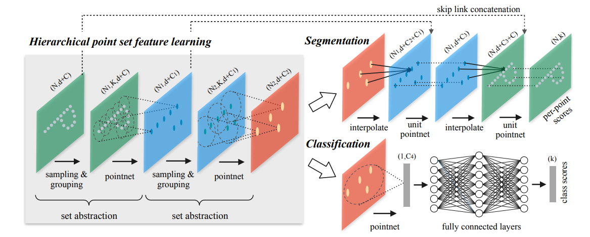

# \[CVPR 2018\] PointNet++: Deep Hierarchical Feature Learning on Point Sets in a Metric Space

지난 PointNet 의 단점들을 보완한 point cloud 를 input으로 하는 더 발전된 형태의 network 인 PointNet++ 입니다. 실제로 point cloud 를 이용한 3D Detection 모델은 대부분 이 모델을 더 많이 이용하는 것으로 보입니다.

## Introduction

지난 PointNet 모델은 point cloud 를 가공하지 않고 raw 한 형태로 이용한 혁신적인 형태의 모델이었습니다. 하지만 이 모델에는 큰 단점을 가지고 있었는데 이는 local structures 를 파악하지 못 한다는 단점이 있었습니다. 이렇게 local feature 를 잡아내지 못 하는 PointNet의 단점으로 인해 fine-grained patterns 나 복잡한 구조를 파악하는 능력이 부족했다고 합니다. 지난 구조를 살펴 보면 PointNet 의 Segmentation 모델에서 특정 지점의 point feature 를 local feature 를 담고 있다고 보고 global feature 와 concat 해서 사용하는 것을 볼 수 있습니다. 하지만 이것으로는 local feature 를 잡아내기에 충분하지 않았나 봅니다. 이러한 이유로 생각해보았을 때 PointNet 은 이미지 내 모든 Point 를 한번에 처리하게 되서 이러한 문제가 발생하는 것인가 라고 생각했습니다. 일반적인 이미지처리를 위한 Conv Net 을 생각해보아도 일정한 크기의 kernel 이 계층적으로 쌓여서 특정 receptive field 를 파악하는 형태로 이루어 집니다. 이번 논문에서 제안하는 개선된 형태의 PointNet 도 이렇게 local feature 를 잡아내기 위해서 모든 Point 를 한번에 처리하지 않고 특정 group 별로 처리하게 되며, Conv Net 과 같이 hierarchical 한 구조로 만들어지게 됩니다.

## Method

### Review of PointNet

해당 논문에서는 PointNet 을 위와 같은 식으로 표현했습니다. 위 함수는 unordered point set {x1, x2, …, xn} (xi ∈ Rd , d: coordinates dimension) 이 주어졌을 때 f: X -> R 의 points to vector 매핑 함수입니다. 이때 r, h 는 주로 multi-layer perceptron networks 로 구성됩니다. 위 함수는 input point permutation (unordered point set) 에 대해서 invariant 하고 이 points 를 통해서 공간적 특징을 encoding 할 수 있습니다. 그러나 different scales 에서 local context 를 파악하는데는 다소 어려움이 있다는 단점이 있습니다. 그렇기에 해당 논문에서는 a hierarchical feature lerning framework 를 도입하게 됩니다.

### Hierarchical Point Set Feature Learning

Figure 2: Illustration of our hierarchical feature learning architecture and its application for set segmentation and classification using points in 2D Euclidean space as an example. Single scale point grouping is visualized here. For details on density adaptive grouping, see Fig. 3 where γ and h are usually multi-layer perceptron (MLP) networks. The set function f in Eq. 1 is invariant to input point permutations and can arbitrarily approximate any continuous set function [20]. Note that the response of h can be interpreted as the spatial encoding of a point (see [20] for details).

PointNet 에서는 single max pooling 을 통해서 전체 point set 에서 정보를 종합하게 됩니다. 해당 논문에서 제안하는 새로운 architecture 에서는 a hierarchical grouping of points 를 해당 hierarchy 를 따라 점점 더 큰 local region 의 feature 를 추출하나갑니다.

해당 hierarchical structure 는 몇 개의 set abstraction levels 라는 구조로 이루어지게 됩니다. 각각의 level 에서 a set of points 가 feature 를 추출한 더 적은 원소로 구성된 새로운 set 을 만듭니다. The set abstraction level 은 three key layers 로 구성됩니다: Sampling layer, Grouping layer, PointNet layer. Sampling layer 에서는 input points 로 부터 a set of points 를 선택하게 되는데 그러면서 local regions 의 centroids 도 정의하게 됩니다. Grouping layer 는 해당 centroids 의 주변 points 를 통해서 local region sets 를 구성하게 됩니다. 마지막으로 PointNet layer 는 원래 PointNet 의 기능인 local region patterns 를 feature vectors 로 encoding 하기 위해서 mini-PointNet 구조를 사용합니다.

A set abstraction level 은 N \* (d + C) matrix 형태의 input을 받게됩니다. 여기서 N 은 d-dim coordinates 와 C-dim point feature 를 갖는 points 개수 입니다. ouput 으로는 N’ \* (d + C’) 형태의 matrix 이고 local context 를 포함하는 d-dim coordinates, 새로운 C’-dim feature vector 의 N’ 개의 subsampled 된 points 입니다.

### Sampling layer

input points {x1, x2, …, xn} 가 주어졌을 때 여기에서는 farthest point samping (FPS) 라는 방법을 통해서 a subset of points {xi1, xi2, …, xim} 을 선택하게 된다. 이 방법은 {xi1, xi2, …, xij-1} 과 가장 거리가 먼 점 xij 을 선택하는 방식으로 진행됩니다. 해당 방법은 같은 개수의 centroids 를 선택할 때, random sampling 에 비해서 전체 영역을 더 잘 커버할 수 있도록 선택하게 된다고 합니다. CNN 이 data distribution 에 무관하게 항상 특정한 영역을 scan 하는 것과는 다르게, 해당 sampling 방법은 data dependent manner 로 receptive fields 를 만들게 된다고 합니다. 이 말을 생각해봤을 때 CNN 은 항상 특정 크기의 kernel 로 진행되기 때문에 항상 일정한 크기의 receptive fields 를 갖지만, point cloud 는 거리 등 여러 요소에 따라 특정 지역의 data distribution 이 달라지게 되고 그에 따라 receptive fields 가 변경될 수 있어서 그런 것 같다고 생각했습니다.

### Grouping layer

이 layer 의 input 으로는 N * (d + C) size 의 point set 과 N’ * d size의 a set of centroids를 받게되고, ouput 으로는 N’ * K * (d + C) size 의 groups of point sets 이 됩니다. 여기서 각 group 은 a local region 에 해당되고, K 는 centroid points 의 주변 points 개수가 되며 이 K는 group 마다 상이할 수 있습니다.

CNN 에서는 a local region of pixel 이 array indices 와 함께 Manhattan distance (kernel size) 에 의해 구성됩니다. metric space 에서 sample 된 point set 에서는 neighborhood of a point 는 metric distance 에 의해 정의됩니다.

group 을 만들기 위해서 여기서는 ball query 혹은 knn 을 이용하게 됩니다. ball query 는 특정 반지름 내에 있는 모든 points (K 개 이하) 를 찾습니다. knn 은 K nearest neighbor 를 찾게됩니다. KNN 과 비교했을 때 ball query 는 고정된 region scale 를 보장하기 때문에 더 선호된다고 합니다.

### PointNet layer

이 layer 의 input 으로는 N’ * K * (d + C) 의 size 를 가지는 N’ 개의 local regions of points 를 받게됩니다. output 으로는 N’ * (d + C’) size 형태로 나오게 되며 각 centroids 마다 local region 이 추출되고 해당 local feature 가 the centroid’s neighborhood 를 encoding 하게 됩니다.

local region 에서 points 의 coordinates 는 a local frame relative to centroid point 로 변환되게 됩니다: xi(j) = xi(j) – x̂(j) for i = 1, 2, …, K and j = 1, 2, …, d, x̂ 는 centroids 좌표. 이렇게 상대 좌표를 사용함으로써 local region 안에서 point-to-point relations 를 찾아낼 수 있게 됩니다.

## Robust Feature Learning under Non-Uniform Sampling Density

point set 은 area 별로 non-unoform density 를 갖는 것이 일반적이다. 이러한 non-uniformity 는 point set feature learning 에 상당한 어려움을 줍니다. dense data 에서 학습된 features 는 sparsely sampled regions 에서 제대로 작동하지 않을 것이고, 따라서 sparse point cloud 에서 학습된 모델도 fine-grained local structures 를 찾아내지 못 할 것입니다.

우리는 finest details 를 잡아내기 위해 densely sampled regions 에서 가능한 closely 하게 points 를 확인하고 싶지만 low density areas 에서는 이러한 것이 불가능 합니다. 이럴 때는 더 큰 scale의 patterns 를 찾아내야 합니다. 이러한 목표를 달성하기 위해 여기서는 input sampling density 가 변할 때 different scales 의 regions 으로부터 features 를 합성하도록 학습하는 density adaptive PointNet layers 를 제안합니다.

위에서 설명한 Hierarchical 한 구조에서는 각 abstraction level 은 single scale 에 대해서 작동하게 됩니다. PointNet++ 에서는 각 abstraction level 은 multiple scales of local patterns 를 추출하여 합성하게 됩니다. grouping local regions 와 combining features from different scales 에 따라 두 가지 형태의 density adaptive layers 를 제안합니다.

Figure 3: (a) Multi-scale grouping (MSG); (b) Multiresolution grouping (MRG).

### Multi-scale grouping (MSG)

첫번째 방법으로는 Fig 3 (a) 에서 보이는 것과 같은 방법으로 Multi-scale grouping 이 있습니다. 이는 다양한 scales 에서 grouping 단계를 적용하고 추출된 features 를 concatenate 하는 방법입니다. 이는 input points 에 대해 random 한 확률로 droping out 을 하며 진행되는데 이를 random input dropout 이라고 합니다. 각 training point set 에 대해서 dropout ratio θ 가 uniform 한 랜덤 확률 [0, p] (p < 1.0) 에서 선택되고, empty point set 을 피하기 위해서 p = 0.95 로 선택되었다고 합니다. 이렇게 함으로써 network 에 various sparsity 와 varying uniformity 를 가진 training set 을 제공할 수 있게 된다고 합니다. test 때에는 가능한 모든 point 를 사용합니다.

### Multi-resolution grouping (MRG)

위의 MSG 방법은 scale 별로 계속 모든 point에 대해서 계산이 이루어져야 하기 때문에 computation 이 너무 expensive 하다고 합니다. 이를 피하기 위한 Fig 3 (b) 에서 보이는 것과 같은 multi-resolution grouping 이 있습니다. 이는 expensive computation 라는 위 MSG 방법의 단점을 보완한 방식입니다.

위 Fig 3 (b) 그림으로 해당 구조를 살펴보자면 특정 level Li 에서 얻어진 features of region 이 concatenation of two vectors 로 표현된 것을 볼 수 있습니다. 왼쪽의 한 vector 는 low level Li-1 에서 set abstraction level 을 이용해서 얻어진 feature 이고 오른쪽 다른 vector 는 local region에서 모든 raw points 를 직접적으로 이용해서 얻어진 feature 입니다.

density of local region 이 low 하면 두 번째 vector 가 더 reliable 하게 되고, high 하면 첫 번째 vector 가 더 reliable 하게 된다고 합니다. 이는 low 할 경우 data 가 너무 sparse 해서 close 하게 확인하기 어렵기 때문에 더 큰 resolution 에서 추출한 vector 가 더 reliable 하게 되고, high 할 경우 close 하게 확인하기 충분히 dense 하기 때문에 더 local feature 를 잘 추출할 수 있게 되기 때문이라고 생각합니다.

### Point Feature Propagation for Set Segmentation

set abstraction layer 를 거치면서 original point set 이 점차 subsampling 되면서 크기가 줄어들게 됩니다. 하지만 set segmentation task 에서는 모든 original points 에 대한 point features를 얻기를 원합니다. 한 가지 해결책으로는 set abstraction level 에서 항상 모든 points를 centroids 로 sampling 해서 진행하는 방법이 있지만 이는 computation 에 있어서 너무 high cost 입니다.

여기서는 이러한 문제를 interpolation 기반의 hierarchical propagation strategy를 이용해서 해결하게 됩니다. feature propagation level 에서 point features 는 Nl * (d + C) points to Nl-1 로 propagate 됩니다. 여기서 Nl , Nl-1 은 set abstraction level l 에서의 input, output size 입니다. interpolation 방법으로는 knn 기반의 방법이 사용된다고 하며 original point set 을 얻을 때까지 해당 방법을 반복해서 적용한다고 합니다. 이 방법은 위 Eq (2) 와 같은 식으로 나타낼 수 있습니다 (default p=2, k=3).

이 방법에 대해서는 추상적으로는 이해가 되나 완전하게 이해가 되지는 않은 것 같습니다…

## Experiments

### Point Set Classification in Euclidean Metric Space

#### MNIST

Table 1: MNIST digit classification

우리가 잘 알고있는 MNIST 데이터셋입니다. 2D 이미지를 2D point cloud 형태로 변환하여 input으로 사용했는데, 기존 PointNet과 비교했을 때 더 좋은 성능을 보이고 있습니다.

#### ModelNet40

Table 2: ModelNet40 shape classification

ModelNet40 데이터셋은 40개의 CAD 모델에 대한 데이터셋입니다. 해당 데이터셋에 대해서도 기존 PointNet 보다 더 좋은 성능을 보이는 것을 알 수 있습니다.