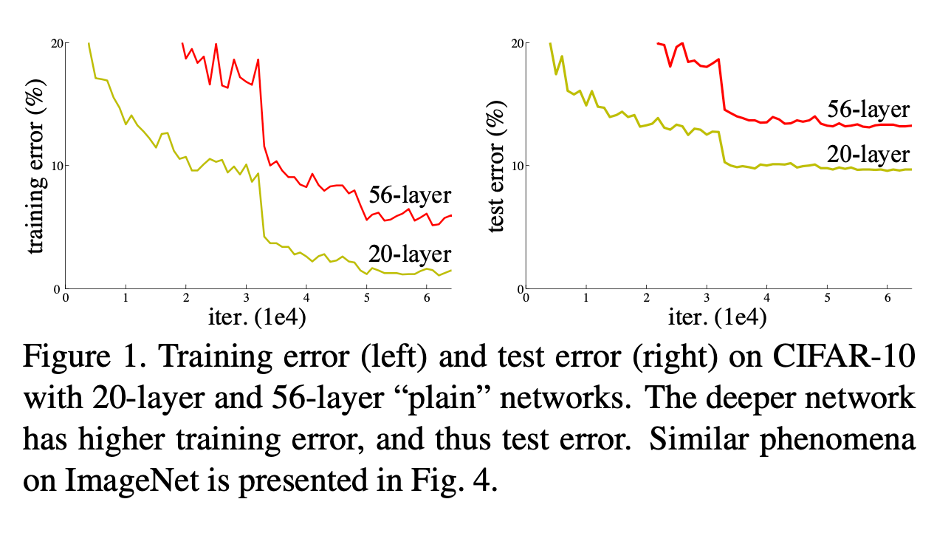
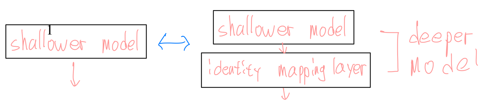
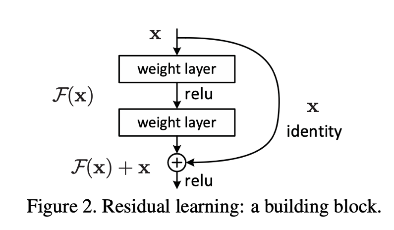
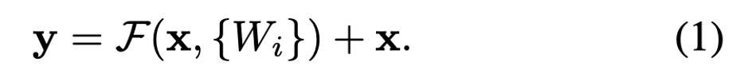
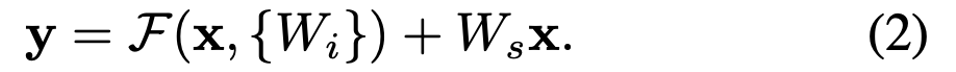
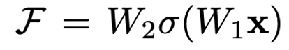
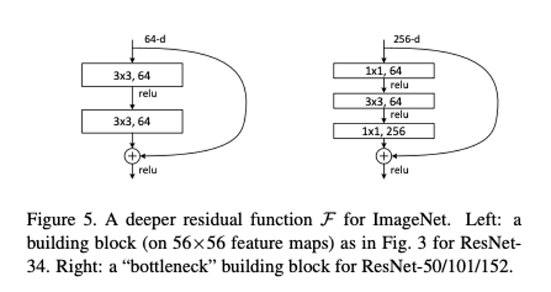

# ResNet: Deep Residual Learning for Image Recognition Paper Review

skip connection, residual block... 등 ResNet 에 대해서 많이 들어는 봤으나 이것들이 깊은 모델을 구성할 때 어떤 효과를 기대하고 사용되었는지는 몰랐었다. 이번에 논문을 직접 읽어보며 이해해보았다.

## 모델이 깊어지면서 발생하는 문제

- CNN은 깊어질 수록 여러 층을 통해 풍부한 features를 얻을 수 있기 때문에 network depth 는 중요하다.
- 하지만 깊은 모델을 학습시키는 것이 쉬울까?
- fig1 을 보면 더 깊은 모델의 성능이 더 좋지 않은 것을 볼 수 있다.
- 이것은 vanishing/exploding gradients 문제인가?
  - 이러한 문제들은 weight initialization, batch normalization 으로 해결되었기 때문에 아니라고 볼 수 있다.
- 모델이 어느정도 deep 해지면 그 이후에는 더 deep 해져도 성능이 안 좋아지는데 이를 여기서 degradation 이라고 한다.
- degradation은 overfitting 에 의한 것이 아니다.
  - fig1 을 보면 더 깊은 모델이 test error 뿐만 아니라 training error 에서도 더 좋지 않은 것을 볼 수 있다.
- degradation 은 모든 시스템이 학습시키기 쉬운 것이 아니라는 것을 나타낸다.

## ResNet Idea 의 출발점

- shallower architecture 와 deeper model 이 있다.
  - deeper model 은 shallower architecture 에 identity mapping 을 하는 layer가 추가된 것이다.
- 위와 같이 구성된 deeper model 은 추가된 layer 가 identity mapping 을 하는 것 뿐이므로 shallower 한 것보다 더 높은 training error 를 보여주지 않을 것이다.

## deep residual learning -> 핵심은 학습을 쉬워지게 하는 것!

- layer 들을 모두 한번에 학습하는 것이 아니라, residual mapping 학습시킨다.
- original mapping: H(x) 이라고 하면 F (x) := H(x) − x
- H 를 학습시키는 것 보다 F 를 학습시키는 것이 더 쉬울 것이다.
  - To the extreme, X(input) 이 optimal 하다면 H 가 다시 identity mapping 이 되어야 output으로 optimal 이 반환되는 것인데 H 가 다시 identity mapping 으로 학습되는 것보다 F 를 0 으로 학습시키는 것이 더 쉽다.
- 이는 “shortcut connections＂로 구현될 수 있다.
  - 추가적인 extra parameter, computational complexity 가 필요 없다.
  - 이를 사용한 Network는 backpropagation 으로 학습 가능하다.
  - 구현하기 쉽다.

## Residual Block -> Resnet 은 이것이 여러 층으로 쌓인 구조

- fig2 는 2개의 층으로 구성되어 이와 같은 식으로 나타낼 수 있다.
- 식 (1) 을 보면 Wi 라고 되어있는 것을 볼 수 있는데, 이는 2개 이상의 layers 를 유동적으로 포함할 수 있기 때문에 W1, W2 로 명시하지 않고 Wi 로 표기한 것을 알 수 있다.
- 하지만 W1 만 사용할 경우 이점을 얻을 수 없기 때문에 2개 이상을 사용한다.
y = W1 \* x + x = (W1 + 1)  \* x -> Wa \* x
- 식 (1) 에서는 x, F 의 dimension이 같아야 한다. 하지만 CNN 에서는 feature map 의 resolution 이 점점 작아지기 때문에 같지 않은 경우 들이 있고 이럴 때 식(2) 를 이용한다.
  - Ws == linear projection 이라고 나와있는데, conv 를 통해 resolution, channel 을 상황에 맞게 조절하는 듯 하다.

## 논문 속 추가적인 내용

- model implementation
- shortcut connection 에서 projection 사용 여부에 따른 차이
  - 큰 차이가 없으므로 degradation 을 해결하는 solution 이 아닌 것을 보고 memory/time complexity 를 고려해 사용하지 않았다고 한다.
- BottleNeck 구조를 이용한 더 깊은 모델 : 34 -> 50, 101, 152
  - 시간적인 것도 고려해야하므로 34 layers 보다 더 깊은 모델을 구현할 때는 BottleNeck 구조를 이용했다고 한다.
- Object Detection 에서도 좋은 결과를 보였다고 한다. -> 적용해보자!
