# \[CVPR 2020\] A U-Net Based Discriminator for Generative Adversarial Networks

이번에 읽은 논문은 Thermal to RGB translation (image-to-image translation, I2IT) 을 하기 위해 여러 논문들을 찾아보면서 알게된 논문입니다. 이 논문은 I2IT 를 직접적으로 다루지는 않았지만 여러 GAN을 사용하는 방법론에 적용이 될 수 있어보이고 간단하게 적용할 수 있지 않을까 싶어서 읽어보게 되었습니다.

## Introduction

여러 GAN 방법론은 진짜와 같은 이미지를 생성하는 generator 와 이 생성된 이미지가 진짜인지 가짜인지 판별하기 위한 discriminator 로 구성이 되며 generator 는 discriminator 를 더 잘 속이게 진짜와 같은 이미지를 생성하도록, discriminator 는 생성된 이미지가 가짜인지 더 잘 판별하도록 각각 학습이 진행됩니다. 여기서 이 discriminator 는 생성된 이미지의 real/fake 를 구분하는 classification 을 진행하는 것이고, 해당 논문에서는 이 discriminator 구조를 개선하는 것으로 GAN 을 사용하는 방법론의 성능 향상을 시킬 수 있다고 합니다.

GAN 방법은 이미지 생성에 있어서 많은 발전이 있었지만, 아직 큰 범위의 구조를 생성하거나 정확한 디테일을 만들어내는 등에 있어서는 어려움을겪고 있습니다. 위에서 discriminator 가 real/fake 를 구분하는 classification 을 수행한다고 말했습니다. 이 discriminator는 이를 효율적으로 수행하는 방향으로 학습하게 되는데 그러다보니 real/fake 이미지에서 가장 discriminative 한 차이에 기반에서 이를 수행하게 되고 이는 discriminator 가 global structure 혹은 local details 중 하나에만 집중하게 만든다고 합니다. 해당 논문에서는 discriminator의 이러한 단점을 해결하고자 구조를 개선했다고 합니다. 거기에 더불어 CutMix augmentation 기법을 추가해서 위 문제를 더욱 해결했다고 합니다.

## Method

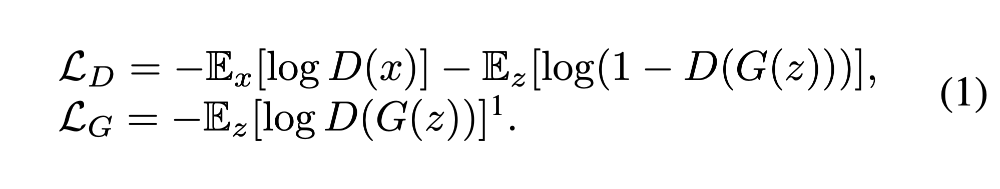

vanilla GAN 방법론은 generator G, discriminator D 로 구성이 되어있어서 위 objective 를 경쟁적으로 최소화 하는 방향으로 학습이 진행됩니다.

### U-Net Based Discriminator

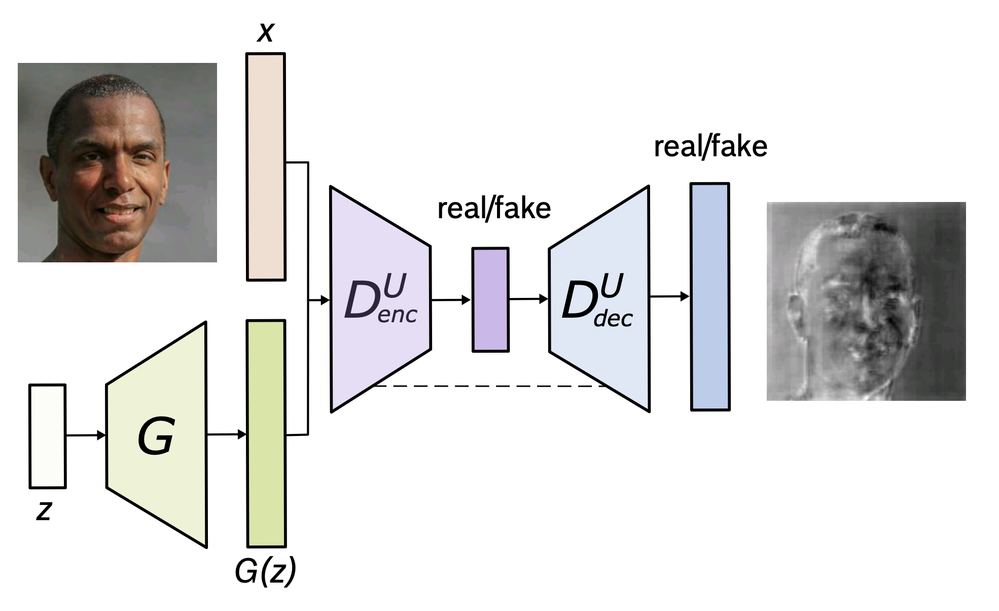
그림1. 제안된 U-Net discriminator 구조.

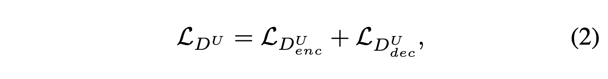
식2. U-Net discriminator 의 loss

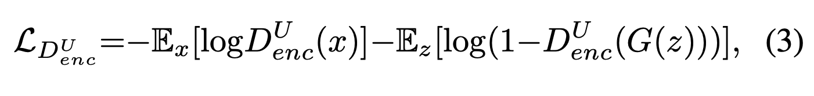
식3. encoder 파트의 전체 이미지에 대한 real/fake classification

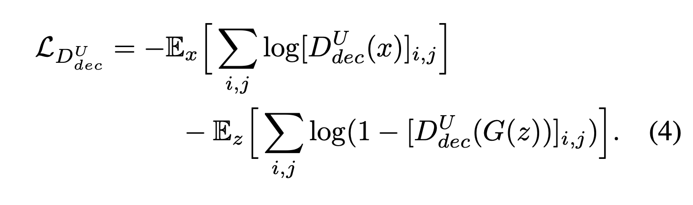
식4. decoder 파트의 pixel-level real/fake classification

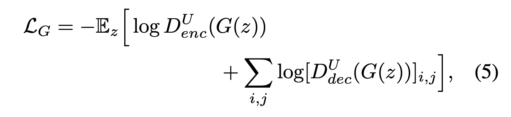
식5. U-Net discriminator 가 적용된 generator

Encoder-decoder 네트워크 구조는 많은 dense prediction 에서 좋은 성능을 내고 있으며 특히 U-Net 은 여러 복잡한 segmentation 에서도 SOTA 성능을 달성하고 있습니다. 여기서는 이러한 U-Net 구조를 가져와 discriminator 에 적용하게 됩니다. 앞의 encoder 파트에서 기존에 진행하던 것 처럼 전체 이미지에 대한 real/fake classification 을 진행하게 되고 decoder part 에서 pixel-level 에서 real/fake classification 을 진행하게 됩니다. 이렇게 전체 이미지에 대해서와 pixel-level 에서 모두 classification 을 진행하게 되면서 discriminator 는 이미지의 global, local 정보를 모두 확인하게되고 classification 을 더 잘 수행하게 됩니다. 또 이렇게 discriminator 의 수행능력이 좋아짐에 따라 generator 는 discriminator 를 더 잘 속이기 위해서 더 실제에 가까운 영상을 생성하게 됩니다.

### Consistency Regularization

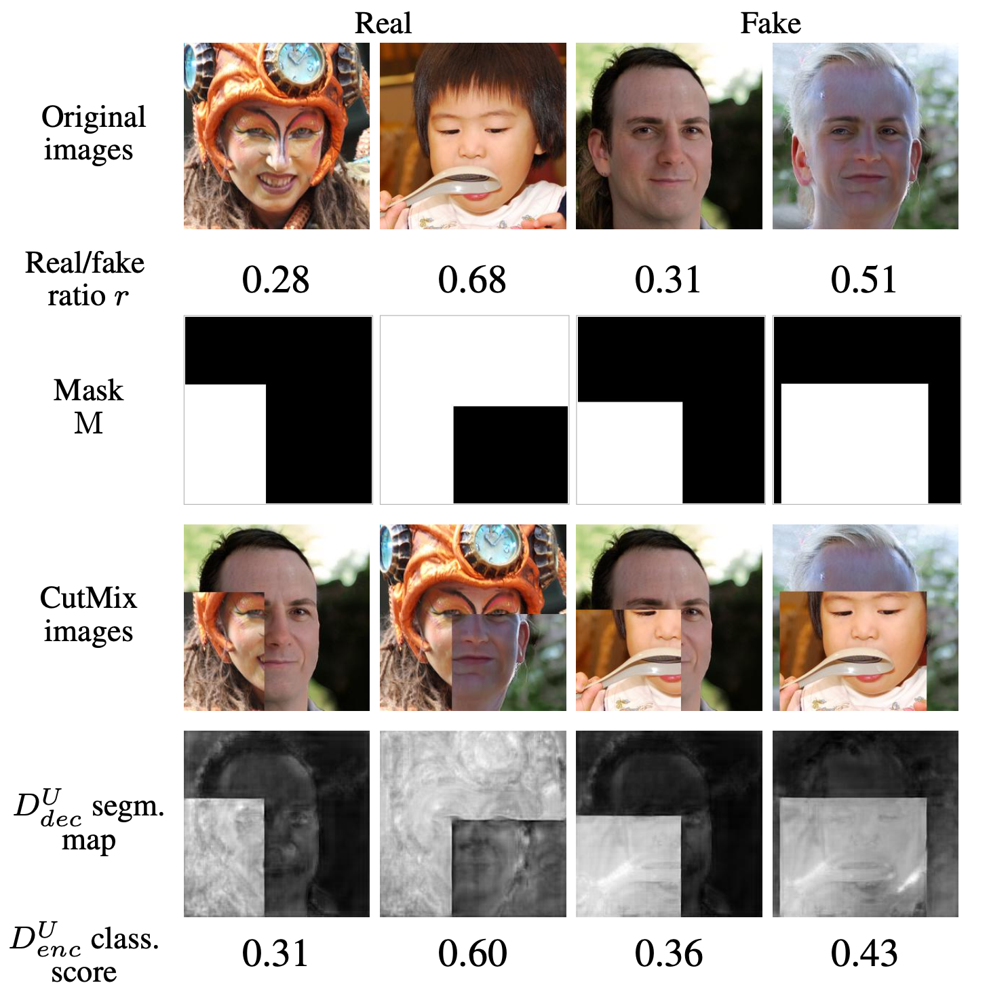
그림2. CutMix augmentation 이 적용된 U-Net discriminator 의 predictions

여기서는 U-Net based discriminator 을 위한 consistency regularization technique 를 도입한다고 합니다. 잘 학습된 U-Net discriminator 의 per pixel decision 은 이미지의 class-domain 이 바뀌는 상황 속에서도 항상 동일해야 하지만 이것이 확실히 보장되지는 않는다고 합니다(이 말이 제대로 이해되지는 않은 것 같습니다…). 이를 가능하게 하기 위해 discriminator 가 real/fake 사이 semantic and structural changes 에 집중하도록 regularized 되어야 한다고 합니다.

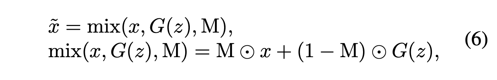
이를 위해서 위 식을 통해 CutMix augmentation 을 진행합니다. 위 식의 M 은 Cut 할 real 이미지에 대한 mask 이고 해당 이미지를 붙혀서 합성된 이비지를 만든다고 합니다.

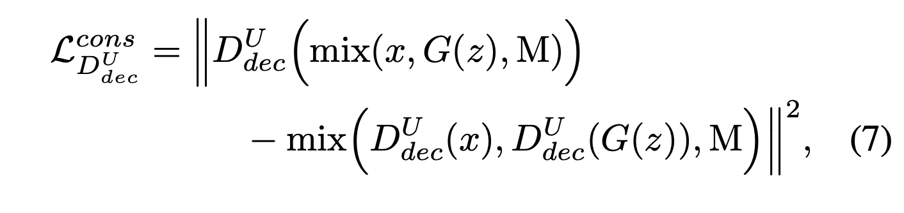
식7. Consistency regularization 이 적용된 discriminator loss

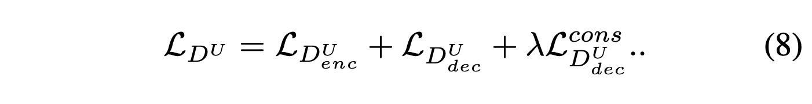
식 8. 전체 discriminator loss

generetor loss 는 식5 에서 변함 없다.

작성하면서 보니 해당 파트에 대한 디테일한 이해가 부족한 것 같네요… 지금으로서는 아직 이해가 잘 되지 않는 것 같습니다. 제대로 이해가 된 후 보강해보겠습니다.

Figures

해당 논문에 실린 몇 가지 결과 사진들로 마무리하겠습니다.

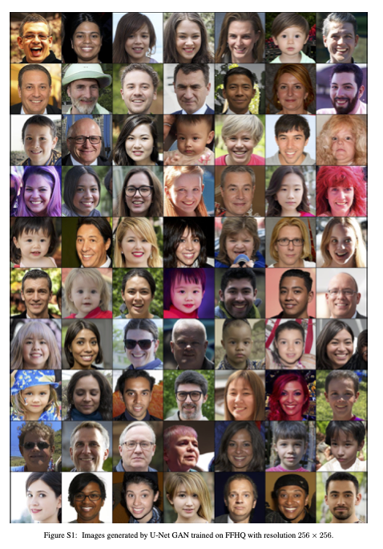
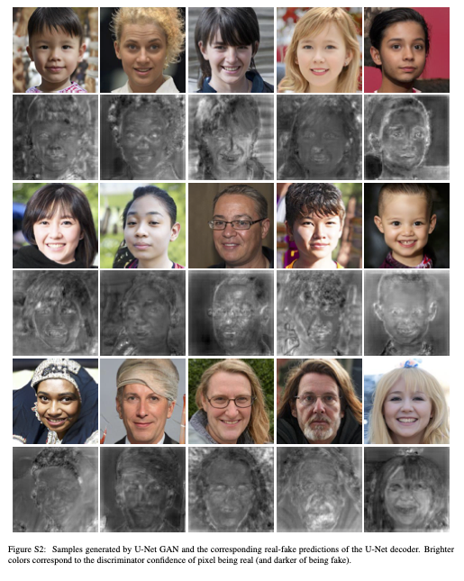

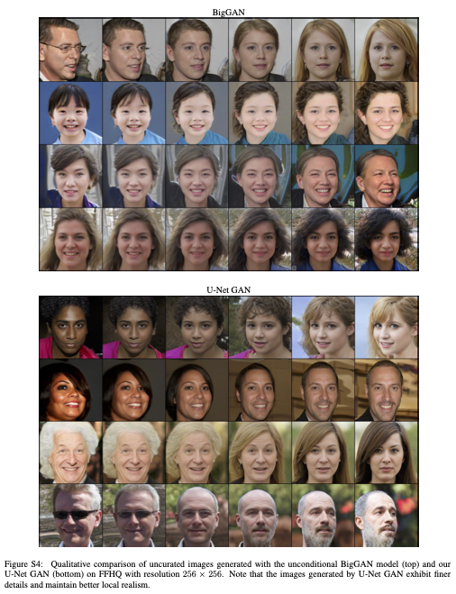
