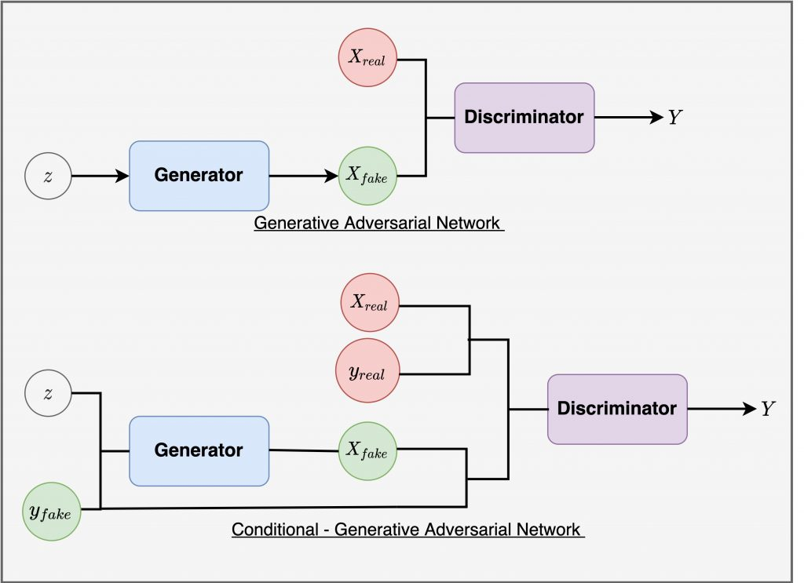
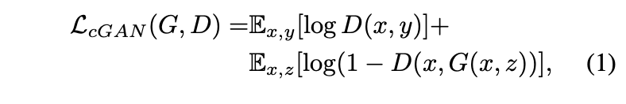
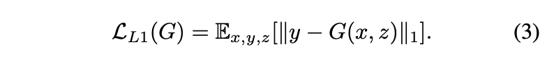
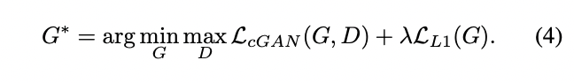
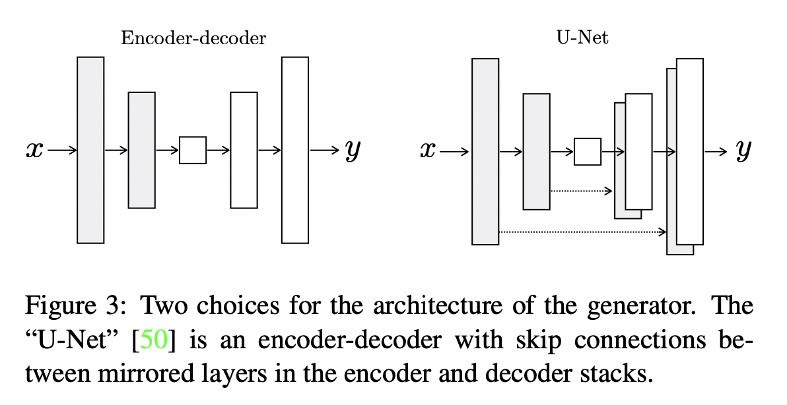

# [CVPR 2017] Image-to-Image Translation with Conditional Adversarial Networks

해당 논문을 선택하게 된 이유로는 연구실에 들어오고 저희 팀에서 수행해야하는 연구들 중 가장 먼저 공부해보고 싶은 것으로 Image translation 을 선택하게 되었고, 처음 볼 논문으로 해당 논문을 추천받게 되었습니다.

## Background

### Conditional GAN (cGAN)

기존의 GAN 은 생성을 위한 입력으로 random noise 인 $z$ 입력으로 받았습니다. 하지만 이는 모델이 출력으로 무엇을 생성할지 제어할 수 없다는 단점이 있습니다. cGAN 은 $z$ 와 더불어 $y_fake$ 라는 condition을 함께 입력으로 받게되고 해당 condition에 맞는 출력을 생성합니다. 예를들어 MNIST 데이터에 대해서 GAN은 0~9 중 어떤 것을 생성할지 제어할 수 없었지만 cGAN은 이를 condition 으로 주어서 원하는 출력을 얻을 수 있습니다.

## Introduction

Image translation 은 이전부터 제기되던 문제 중 하나였다고 합니다. 해당 문제의 다양한 task가 있었지만 결국 같은 일을 해야되는 것임에도 불구하고 task 마다 loss 를 각각 구성하는 등 새로운 세팅을 해주었다고 합니다. 또, 기존의 단순한 Euclidean distance 를 통한 loss 는 전체 outputs 의 평균을 최소화하는 방향으로 진행되기 때문에 결과를 blurr 하게 만드는 경향이 있다고 합니다. GAN 방법을 통해서 이 문제를 해결하게 되었는데, 이는 실제와 구별하기 힘든 결과를 만드는 한가지 목표를 갖게 되어 생성 모델이 실제 이미지와 오차가 적은 이미지를 생성함과 동시에 생성한 이미지가 실제인지 가짜인지 구별하도록 loss 를 학습하며 진행됩니다. blurry images 또한 실제와 같지 않기 때문에 가짜로 분류되고 이렇게 blurr 한 결과를 갖는 문제도 해결하게 됩니다. 여기에 cGAN 의 특정 condition 에 대한 결과를 생성하기 특징은 cGAN 이 Image-to-Image translation 에 적합하게 한다고 합니다.

이렇게 GAN 은 활발하게 연구되고 있고 해당 논문에서 연구하는 기술들도 이전에 제안된 것들이라고 합니다. 하지만 이전에는 적용에 초점을 두고 있었고 image-conditional GAN 이 Image-to-Image translation 에 얼마나 효과적일지는 불명확했다고 합니다. 해당 논문의 주된 contribution 은 두가지가 있다고 합니다.

1. conditional GAN 이 다양한 문제에서 합리적인 결과를 도출해내는지를 설명하는 것
2. 좋은 결과를 얻기에 충분한 간단한 프레임워크를 제시하고 몇 가지 중요한 구조적 요인을 분석하는 것

## Method

### objective

- z : random noise vector
- y : output image -> 아래 식에서는 GT…?
- x : observed image
- G : generator
- D : discriminator

위 식은 cGAN 의 목적함수입니다. 여기서 D, G 의 입력으로 x가 함께 들어가게 되는데 이는 condition에 해당되는 정보이며 예를 들면 segmentation label -> RGB 에서는 segmentation label 에 해당되는 값입니다. G 가 목적 함수를 최소화 하려고 하고 동시에 적대적인 D는 목적 함수를 최대화 하려는 방향으로 학습된다고 합니다. 즉, $D(x, y)$ 는 실제 이미지를 정답으로 분류 해야되므로 1을 향해가며 전체적으로 목적함수를 최대화 시키고 $D(x, G(x, z))$ 에서 $G(x, z)$ 는 실제와 같은 이미지를 생성하려고 할 것 이고 이는 discriminator 를 속여 생성된 이미지를 진짜라고 믿게 만들어 $D(x, G(x, z))$ 가 1을 향하도록 해서 전체적으로 목적함수를 최소화 시킨다.

위 식은 생성된 데이터의 분포가 다른지를 계산하기 위한 식이고 이를 통해 generator는 discriminator 를 속이는 것 뿐만 아니라 GT와 가까운 이미지를 생성하여야 한다. L2 가 L1 보다 blurring이 더 심하기 때문에 L1 을 사용했다고 합니다.

위 식은 최종 목적함수 입니다.

## Network architecture

### Generator with skips

이전에는 왼쪽과 같은 기본적인 encoder-decoder 구조가 사용되었었다고 합니다. 하지만 이는 정보의 병목을 갖게됩니다. 많은 image translation 문제에서 input – output 사이의 정보는 공유될 수 있기 때문에 병목현상을 막기 위해 오른쪽과 같이 skip connection 을 통해 정보를 직접 전달하는 것은 효과적일 수 있다고 합니다. 정보가 공유될 수 있다는 것은 예를 들어 colorization 에서 input 과 output 은 대부분의 edge 를 공유합니다.

### Markovian discriminator (PatchGAN)

$L_2$, $L_1$ Loss 는 blurr 한 이미지를 생성하게 만듭니다. 그렇기 때문에 좀 더 sharp 한 이미지를 얻기 위해 PatchGAN 이라는 discriminator 를 사용한다고 합니다. 이는 이미지의 real or fake 를 구분할 때 이미지 전체에 대해서 진행하는 것이 아니라 전체 이미지의 특정 사이즈인 patch 단위로 convolutional 하게 진행해서 그 평균을 이용한다고 합니다. 이렇게 해서 멀리 있는 픽셀과는 독립적으로 지역적 특징이 반영되어 더 sharp한 이미지를 얻을 수 있다고 합니다.

## Limitation

서로 도메인이 다른 두 이미지 X, Y의 데이터를 한 쌍으로 묶어서 학습이 진행되어야 합니다. 이런 데이터를 얻기 쉬운 경우도 있지만 그렇지 못 한 경우가 많다고 합니다.