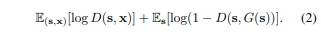
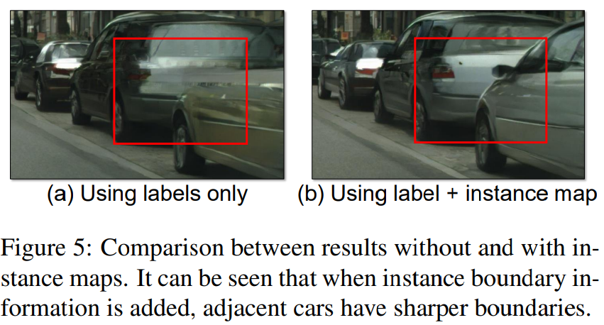

# [CVPR2018] High-Resolution Image Synthesis and Semantic Manipulation with Conditional GANs

## Before Review

Image translation 에 대해 공부하기 위해 지난 번에 pix2pix 를 공부하고 그 후에 많이 언급이 되던 CycleGAN 을 살짝 보았습니다. 이는 pix2pix의 항상 pair 한 데이터 셋을 가지고 있어야만 한다는 문제를 해결해주었습니다. 그 후 또 무엇을 봐야할까 헤매던 중 이 논문을 추천받게 되었습니다. 이 논문을 읽고 생각해보니 다음과 같은 이유로 이 논문의 방향이 제가 이전에 봤던 CycleGAN 보다 더 추후 진행해야할 업무에 더 맞는 방향이라고 생각이 들었습니다.

1. pair 한 데이터셋으로 학습하는 것이 더 성능이 좋은데, 현재 저희의 업무에서는 Thermal, RGB 카메라로 동시에 데이터를 취득할 것이기 때문에 굳이 Unpair 한 데이터 상황에 대해 고려할 필요가 없다.
2. 해당 논문에서는 Segmentation label map to Photo image translation 을 진행하였는데 해당 내용을 Thermal to RGB photo image 에 접목해보며 생각해볼 수 있지 않을까?

네 그럼 리뷰 시작해보겠습니다.

## Introduction

해당 논문에서는 semantic label map 으로 high-resolution photo-realistic image 를 생성하는 방법을 제안하였습니다. semantic label -> image translation 은 기존에 pix2pix 가 자주 이용되었다고 합니다. 하지만 Adversarial networks 가 안정적이지 않고 high-resolution image 생성은 잘 해내지 못 했다고 합니다. 이 문제를 해결하기 위해 perceptual loss 라는 것이 이용되었지만 이것은 fine detail 과 realistic texture 를 잘 살리지 못 하는 문제가 있다고 합니다. 그렇게 이 논문에서는 GAN 들의 high-resolution 을 생성하는 것에 있어서의 어려움과 이전 방법론들의 high-resolution image 에서의 detail, realistic texture 부족을 주된 문제점으로 삼고 새로운 robust adversarial leaarning objective 와 함께 new multi-scale generator and discriminator architectures 를 통해서 이를 해결할 수 있음을 보여줍니다. 뿐만 아니라 instance-level segmentation information 을 이용해서 개별 objects 를 더하고 빼거나 그 유형을 바꾸는 object manipulation 과 같은 input label map 을 통해서 다양한 results 를 생성하는 방법 같은 interactive semantic manipulation 가능하도록 했습니다.

## Method

### The pix2pix Baseline

해당 논문의 방법론을 설명하기 이전에 기존의 pix2pix 에 대해 다시 짚고 넘어가겠습니다. pix2pix 는 image-to-image translation 을 위한 conditional GAN framework 입니다. 이는 translation 을 위한 G 와 real image 와 translated image 를 구분하기 위한 D 로 이루어집니다. 학습에 대해서는 예를 들어 semantic label map to image translation 을 수행한다면 semantic label map 에 해당하는 image 를 pair로 갖는 데이터 셋을 이용해야 하므로 supervised setting 입니다. L_GAN 을 보면 아래와 같고

generator 로 U-Net 을 사용하고 discriminator로 patch-based fully convolution discriminator 사용합니다. 그러나 256 * 256 resuolution 의 이미지까지 생성하는 것만 가능하고 그 이상의 resolution에 대해서는 학습이 불안정하거나 만족스럽지 않은 이미지가 생성된다고 합니다. 그렇기 때문에 여기서는 이 pix2pix framework 를 개선합니다.

### Improving Photorealism and Resolution

이 논문에서는 pix2pix framework 를 a coarse-to-fine generator, a multi-scale discriminator architecture, and a robust adversarial leraning objective function 을 이용해서 개선한다고 한다.

#### Coarse-to-fine generator

그림에서 볼 수 있듯이 일반적인 G 하나로 generator 가 구성되지 않고 G = {G_1, G_2} 이렇게 둘로 구분됩니다. 여기서 G_1 은 the global generator network 이라고 하고 G_2 는 the local enhancer network 이라고 합니다. The global generator 는 1024 \* 512 resolution 에 대해서 동작하고 the local enhancer 는 그에 4배 ((2 \* width) \* (2 \* height)) 에 대해서 동작한다고 합니다. G = {G_1, G_2, G_3} 처럼 추가적인 local enhancer networks (G_3) 를 이용해서 더 큰 resolution에 대해서도 적용할 수 있다고 합니다.

The global generator network 는 a convolution front-end G1(F), a set of residual blocks G1(R), and a transposed convolutional back-end G1(B) 로 구성되어 input 인 1024 \* 512 resolution semantic label map 이 차례대로 통과하여 1024 \* 512 output 이 생성됩니다.

The local enhancer network 도 같은 형태로 구성되는데 the global generator network 와 다르게 G_2(R) 의 input 은 G_2(F) 의 output feature map 과 The global generator network 의 마지막 output feature map 인 G_1(B) 의 output feature map 이 element-wise sum 된 것이 input 으로 받게 됩니다. 이는 G_1 의 global information 을 G_2 와 통합하는 것을 돕습니다.

학습할 때, 처음에 the global generator 를 학습하고 그 다음에 the local enhancer 를 resolution 순서대로 학습합니다. 그 후에 모든 network를 연결하여 다 함께 fine-tuning 을 진행합니다. 이러한 generator 구조는 image 합성을 위한 global and local information 을 잘 종합시킬 수 있다고 합니다.

#### Multi-scale discriminators

high-resolution image synthesis 에서 기존 GAN discriminator 는 real/fake 를 구분하기 위해 network 구조가 커지게 됩니다. 그로 인해 학습에서의 어려움이 생기고 많은 메모리 용량이 필요하게 됩니다. 이 문제를 해결하기 위해서 이 논문에서는 multi-scale discriminators 를 제안합니다. 여기서는 구조는 같으나 다른 image scale 에 대해 작동하는 D_1, D_2, D_3 이렇게 세 discriminators 를 이용하며 scale 이 다른 image 를 만들기 위해 real / synthesized image 를 2, 4 factor 로 downsampling 하여 진행합니다. 이 세 discriminators 가 같은 구조를 갖지만 the coarest scale 에 대해서 동작하는 것은 가장 큰 receptive field 를 갖으며 image 에 대해 좀 더 global 한 view 를 갖게 되고, the finest scale 에 대해서 동작하는 것은 좀 더 세밀한 details 를 만들어 낸다고 합니다. low-resolution model 에서 higher resolution 으로 확장하는 것은 처음부터 재학습하지 않고 finest level 에 discriminator 를 추가하면 되므로 이는 coarse-to-fine generator 학습을 더 쉽게 만들어 줍니다 (정확히 이해되지 않은 부분… 다시 자세히 보기… 코드를 확인한다거나…). 이 여러 discriminators 로 인해 Eq. (1) 이 아래와 같이 a multi-task learning problem이 된다.

#### Improved adversarial loss

여기선느 기존 Eq. (2) 에 a feature matching loss based on the discriminator 를 추가하여 개선하였다고 합니다.

이는 다양한 층의 feature map 을 통해 계산합니다. Dk(i) 는 i 번째 layer 로부터 input 을 받습니다. T 는 전체 layers 수 이고, Ni 는 각 layer 의 elements 수 입니다. generator 는 multiple scales 에서 natural statics 를 만들어 내야 하므로 위와 같은 feature matching 은 학습을 안정적으로 하는데 도움을 줄 수 있다고 합니다. 최종적인 objective 는 아래와 같습니다.

### Using Instance Maps

기존에는 image synthesis 를 위해서 semantic label maps 만 이용하곤 했다. 그러나 이는 각 object 별로는 구분하지 못 한다는 단점이 있다. 이를 해결하기 위해 sementic label maps 뿐만 아니라 Fig. 4에서 보는 것과 같은 boundary map 을 추가적으로 이용해서 semantic label map 과 channel-wise concatenation 해서 이용했다고 합니다. 그 결과 Fig. 5 에서 볼 수 있는 것 처럼 각 object 별 구분이 더 뚜렷해졌습니다.

### Learning an Instance-level Feature Embedding

같은 input 에 대해서 다양한 images 를 생성하고 instance-level control 을 하기 위해서 여기서는 additional low-dimensional feature channels 를 generator network input에 추가하는 것을 제안하였습니다.

The low-dimensional features 생성하기 위해서 여기서는 encoder network E 를 이용합니다. E ground truth target 의 각 instance에 일치하는 low-dimensional feature vector 를 찾도록 학습됩니다. 그렇게 Eq. (5) 에서 G(s) 는 G(s, E(x)) 로 됩니다. encoder 의 학습이 다 완료되면 training images 의 모든 instances 에 대해 한번 running 하여 features 를 얻습니다. 그 후 각 semantic category 에 대해 K-means clustering 을 진행합니다. 각 cluster는 도로의 texture (아스팔트냐 자갈이냐) 등의 특정한 스타일을 갖게됩니다. 이제 inference 를 수행할 때 무작위로 이 cluster center 를 선택하여 여러 스타일의 이미지를 만들어 낼 수 있습니다. 위 내용… 잘 이해 안 되므로 코드 등 보면서 다시 이해하기…

## Evaluation

위 표는 생성된 이미지와 실제 이미지를 통해 다시 semantic segmantation 을 수행하여 그 점수를 비교한 지표입니다. 여기서 생성된 이미지로 얻을 수 있는 점수 실제 이미지로 수행한 점수 (Oracle) 를 upper-bound 라고 하였는데, 해당 방법론으로 생성한 이미지로 평가한 결과 기존의 방법론보다 큰 성능 향상이 있었으며 거의 upper-bound에 근접한 것을 볼 수 있습니다.

위 표는 이전에 사용되던 방법론들과 이번 논문에서 소개하는 방법론으로 생성된 이미지 둘을 놓고 실제로 어떤 것이 더 실제와 같았는지 비교해본 평가 지표 입니다. 이 논문에서 소개된 방법이 훨씬 더 실제와 같다는 선택을 많이 받은 것을 알 수 있습니다.

위 표는 주어진 시간 안에 실제 이미지 혹은 특정 방법론으로 생성된 이미지 들을 비교하는 지표입니다. 전반적으로 이 논문에서 소개된 방법론이 더 우수한 것을 볼 수 있습니다.

이번 방법론과 다른 방법론들로 생성한 이미지들을 정성적으로 비교해보며 리뷰를 마치겠습니다.

